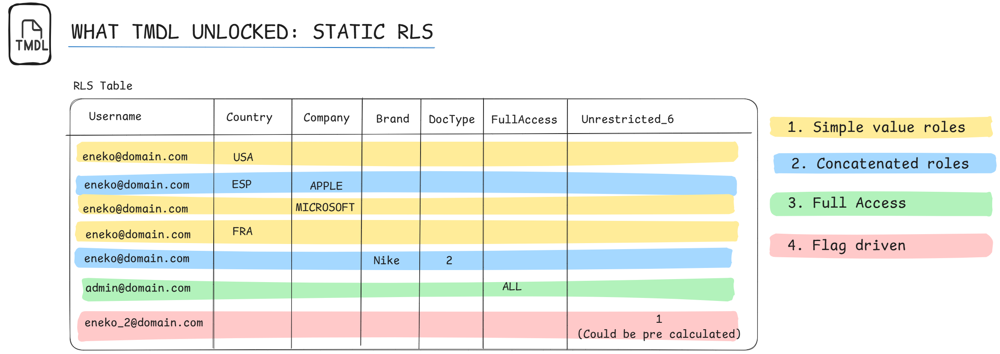
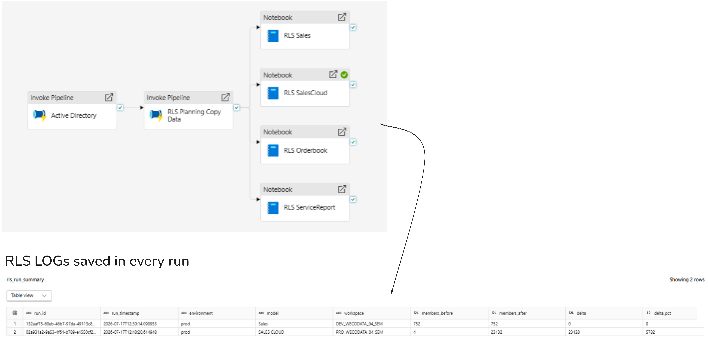
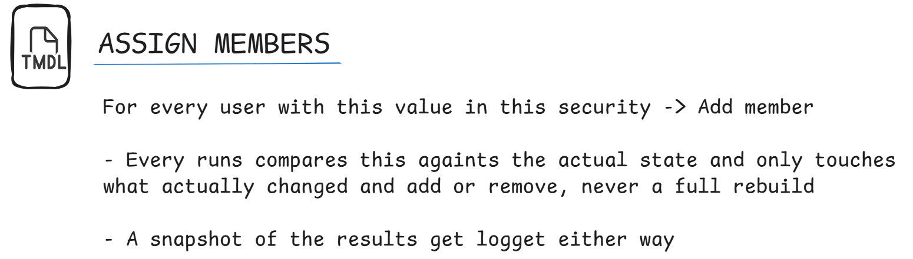

# Semantic Link — Static RLS Role Manager

**Fabric Semantic Link Developer Experience Challenge 2026**
**Author:** eguigurene

Automates the full lifecycle of static Row-Level Security (RLS) roles in a Power BI Semantic Model — creation, member sync, cleanup, and audit — using Microsoft Fabric notebooks, `semantic-link-labs`, and the Tabular Object Model (TOM).

---

## Why static roles

Dynamic RLS (`USERPRINCIPALNAME()` filtered against a security table) evaluates on every query, for every user — on a large fact table, that gets slow fast. **Static roles are resolved once, at connection time.** The hard part has always been generating and maintaining hundreds of them by hand. This project automates that, plus keeps a full audit trail, since unattended scripts that can silently change access need one.

New here? [`docs/IMPLEMENTATION_GUIDE.md`](./docs/IMPLEMENTATION_GUIDE.md) is a direct, step-by-step walkthrough from zero to a running pipeline.

---

## Role types

Everything in this repo is built out of five primitives:

| Type | Config shape | What it does |
|---|---|---|
| **Standard** | `"table"`, `"column"`, `"source_column"` | One role per unique value |
| **Concatenated** | `"concatenated_from": {...}` | Combines columns (optionally across tables) into one AND-ed condition |
| **`full_access`** | `"special": "full_access"` | No filter, granted by a flag |
| **`consolidated`** | `"special": "consolidated"` | Flag AND every other listed column blank |
| **`consolidated_default`** | `"special": "consolidated_default"` | Everyone except named exceptions |

Two modifiers: **`is_numeric: True`** (compares unquoted, needed for Integer columns) and **`extra_filter`** (a fixed condition AND-ed onto every role in that entry).

None of these know about each other. **Power BI unions all of a user's roles per table** — that's where the real flexibility comes from. Extending the model usually means adding one more role, not editing existing config. See [`docs/CONFIGURATION_REFERENCE.md`](./docs/CONFIGURATION_REFERENCE.md) for the full breakdown, and [`docs/CONFIG_TO_ACCESS_EXAMPLE.md`](./docs/CONFIG_TO_ACCESS_EXAMPLE.md) for a worked example tracing config → roles → real user access.



---

## Two examples in this repo

- **`examples/RLS_Example1.ipynb`** — flat model, every dimension restricts independently.
- **`examples/RLS_Example2.ipynb`** — access conditioned on record type; required dataframe prep (a precomputed flag + row explosion) before the same config primitives could express it.

Same library, same functions, no code changes between them — only what the dataframe looked like by the time the config read it.

---

## Running in production

This runs as a scheduled pipeline: sync Active Directory → refresh RLS source data → fan out to one notebook per secured model, in parallel. Adding a model means adding one notebook, not touching the others — they share the library and write to the same audit tables without knowing about each other.



Every run lands in three shared tables (`rls_membership_snapshot`, `rls_change_log`, `rls_run_summary`), queryable together regardless of which model wrote them.  See [`docs/IMPLEMENTATION_GUIDE.md`](./docs/IMPLEMENTATION_GUIDE.md#7-sync-membership-through-the-audit-wrapper) for a real execution log.




---

## Prerequisites

- Fabric workspace with a Lakehouse, Power BI semantic model published to it, XMLA Read/Write enabled
- `semantic-link-labs` — reliably available via a **custom Fabric Environment** (Data Engineering → Environments → add it as a public library, publish, then attach via the notebook's Environment dropdown). `%pip install` inline works too, but doesn't persist and can silently fail to expose `connect_semantic_model` in `%run`-chained notebooks. Switching environments needs a Spark session restart — re-running cells alone won't pick it up.
- An RLS source table with at minimum `Username` (UPN) + one column per secured dimension

`RLS_Management_Functions.ipynb` is self-contained — it imports everything it needs. The two example notebooks each `%run` a `Connections` notebook (Lakehouse paths) and, optionally, an `Email notifications` notebook (only if using `alert_to=`). Neither is included, since they'd contain real workspace names and credentials — templates with the exact contract are in [`setup notebooks/`](./setup%20notebooks).

---

## Usage

```python
# Only if config uses concatenated_from
df, config = preprocess_concatenated_roles(df, config)

create_or_replace_roles(config, dataset, workspace, global_filters, rls=df)
drop_unused_roles(config, dataset, workspace, rls=df)

result, summary = run_with_audit(
    update_members_delta,
    config=config, dataset=dataset, workspace=workspace, env="prod",
    rls=df, chunk_size=200,
    audit_path=path_control,
    alert_to="your-team@yourcompany.com",
)
```

| Function | Purpose |
|---|---|
| `preprocess_concatenated_roles()` | Builds synthetic columns for `concatenated_from` |
| `create_or_replace_roles()` | Creates/updates roles + DAX — refreshes filters even on existing roles |
| `update_members_delta()` | Syncs only the membership delta, batched with automatic failure isolation |
| `drop_unused_roles()` | Removes roles no longer backed by data |
| `run_with_audit()` | Wraps any sync with snapshots, change log, summary, and alerts |

All accept `config_keys=[...]` to process a subset.

---

## File structure

```
README.md
LICENSE
RLS_Management_Functions.ipynb    ← core library
examples/
├── RLS_Example1.ipynb
└── RLS_Example2.ipynb
setup notebooks/
├── Connections_template.md
└── Email_notifications_template.md
docs/
├── IMPLEMENTATION_GUIDE.md
├── CONFIGURATION_REFERENCE.md
└── CONFIG_TO_ACCESS_EXAMPLE.md
assets/
└── *.png
```

---

## Related

- [semantic-link-labs](https://github.com/microsoft/semantic-link-labs)
- [TMDL view in Power BI Desktop](https://learn.microsoft.com/en-us/power-bi/transform-model/desktop-tmdl-view)
- [XMLA endpoint connectivity](https://learn.microsoft.com/en-us/power-bi/enterprise/service-premium-connect-tools)
- [Fabric Semantic Link Developer Experience Challenge](https://community.fabric.microsoft.com/t5/Power-BI-Community-Blog/Announcing-the-Fabric-Semantic-Link-Developer-Experience/ba-p/5139639)

## Contributing

Issues and PRs welcome — especially for patterns not covered here (OLS, cross-workspace models, other role types).

## License

MIT
